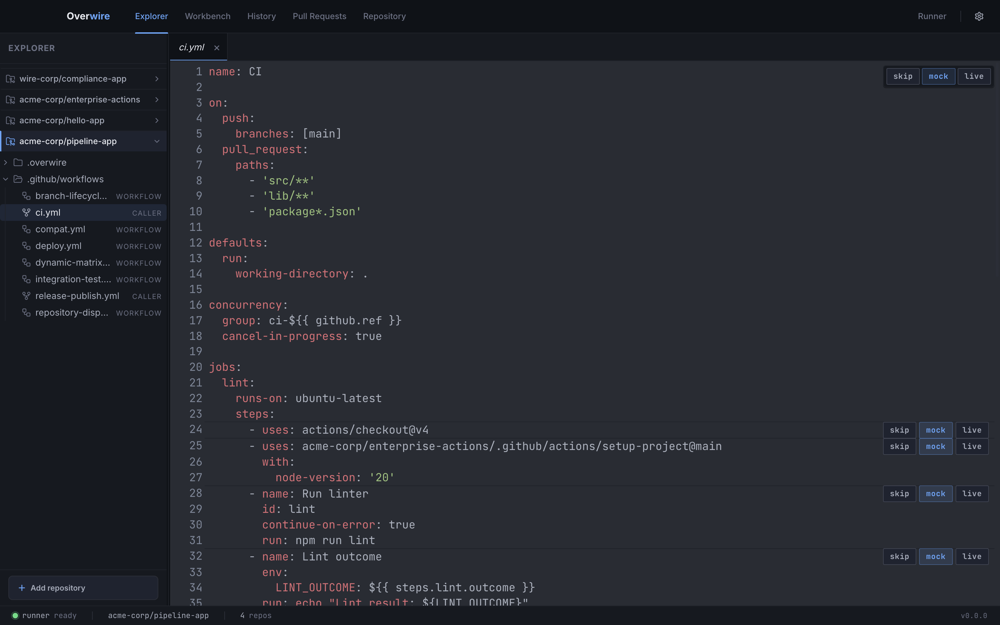
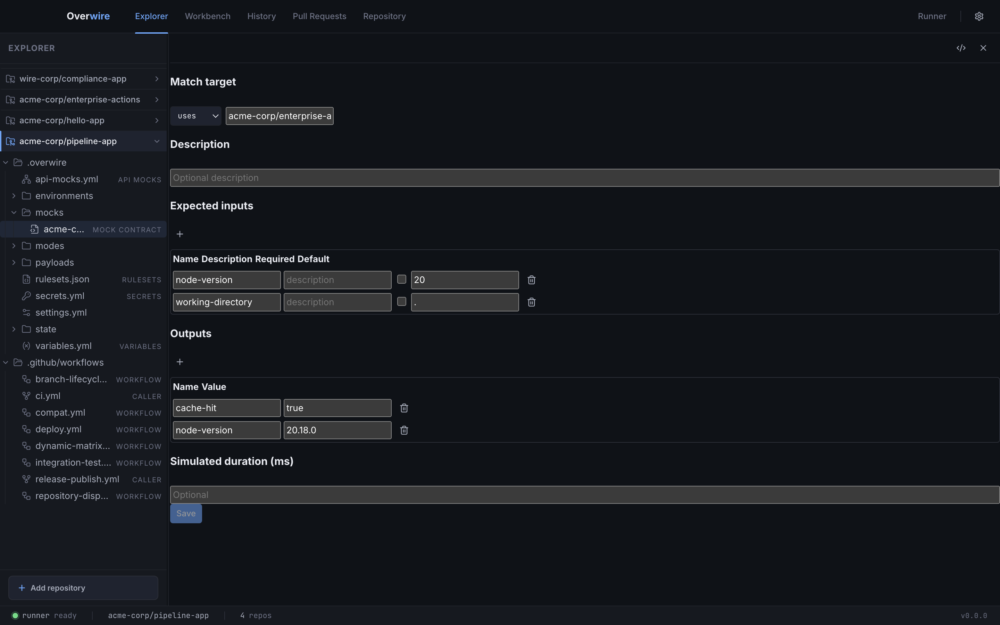
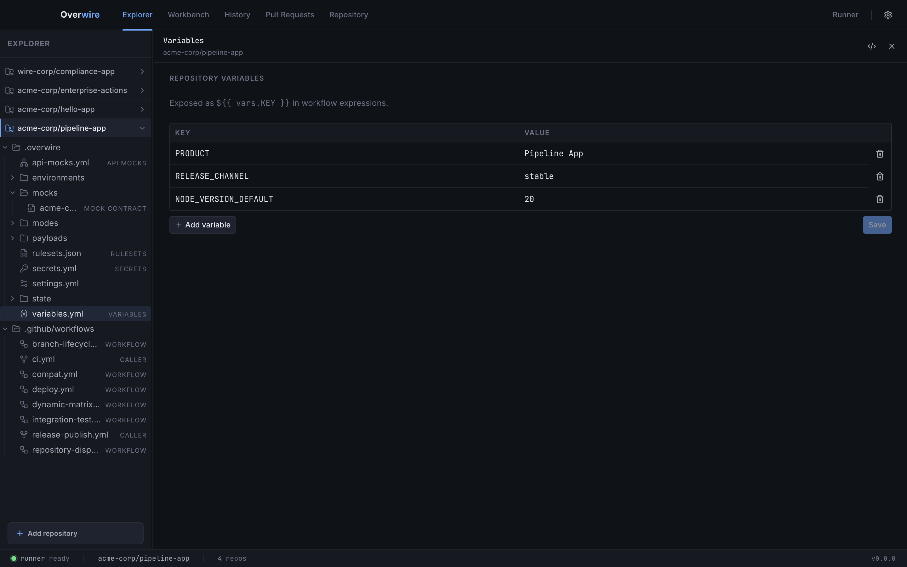

The Explorer page pairs a workspace tree with tabbed editors. The tree shows each repository's `.github/workflows/` files and its `.overwire/` config directory; tabs are keyed by repository and path, so `variables.yml` from two repos in the same workspace open as separate tabs without colliding.

## Workflow viewer

Workflow YAML opens read-only with syntax highlighting, inline lint diagnostics, and a mode button group on every step line. Clicking skip, mock, or live writes the override to [`modes/<workflow>.yml`](/configuration/modes/); the workflow file itself is never modified. A default-mode control at the top of the editor sets the workflow-wide fallback.

The same diagnostics the [`lint` command](/cli/lint/) reports appear inline: deprecated workflow commands, unpinned actions, duplicate step IDs, and unknown runner labels.

## Mock contract editor

Mock contract files under `mocks/` open in a structured editor instead of raw YAML: the match target (a `uses:` reference or step ID), a description, expected inputs with required flags and defaults, the outputs to synthesize, and an optional simulated duration. Saving writes the [contract file](/configuration/mocks/) the engine validates against at run time.

## Modes file viewer

Opening a `modes/<workflow>.yml` file directly shows each job and step with inline mode toggle buttons, which is the fastest way to review every override in one place.

## Repo settings editors

- **Variables** edits [`variables.yml`](/configuration/variables/) as a key-value table, exposed to workflows as `${{ vars.KEY }}`.
- **Secrets** edits declarations in [`secrets.yml`](/configuration/secrets/). The editor shows names and whether a value is present; values themselves never reach the UI. If literal values would be committed to git, the editor warns and offers to add the ignore rule.
- **Rulesets** edits [`rulesets.json`](/configuration/governance/) in the platform's native export format.

Every structured editor has a raw-YAML toggle in its header for editing the underlying file directly.
