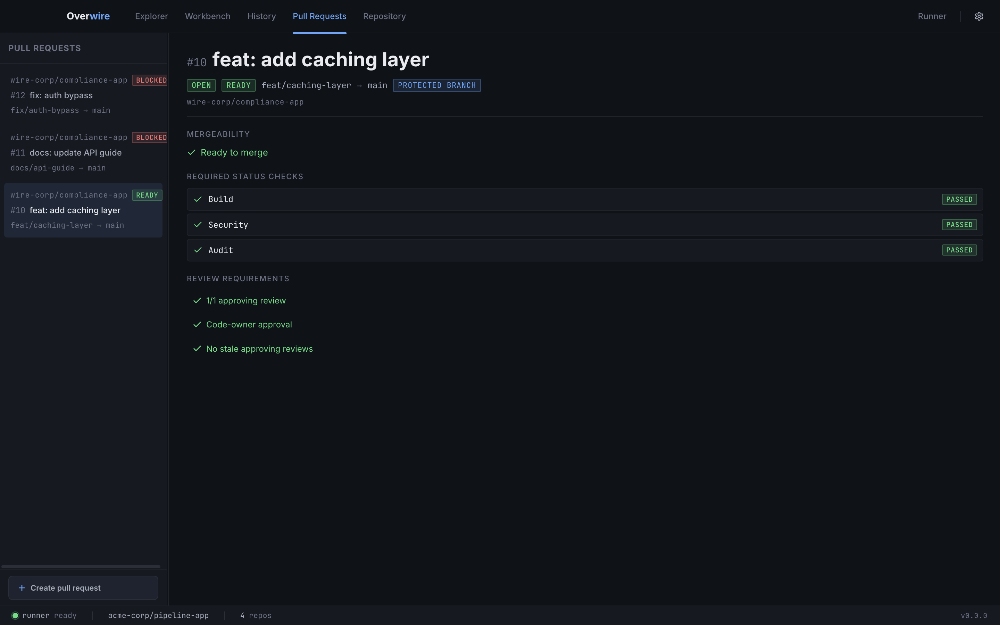

The Pull Requests page answers one question before you push: **would this PR be mergeable?** It evaluates local PR scenarios against your rulesets, required status checks, and CODEOWNERS rules, and renders the verdict the platform would reach. Everything is local scenario data; nothing is fetched from or written to any remote.

## PR scenarios

Scenarios live in [`pull-requests.yml`](/configuration/scenarios/): number, title, head and base branches, changed files, and reviews. The sidebar lists them with a READY or BLOCKED badge per scenario, and **Create pull request** opens an editor for adding one without touching the YAML by hand. Each scenario belongs to a repository, so a multi-repo workspace lists scenarios from every peer.

## The prediction

The detail view breaks the verdict into the same gates the platform applies:

- **Mergeability** is the headline: ready to merge, or blocked with the failing gate named.
- **Required status checks** come from your [rulesets](/configuration/governance/) for the base branch, matched against [`statuses.yml`](/configuration/scenarios/) and check runs recorded by local workflow runs.
- **Review requirements** evaluate approval counts, code-owner approval against your CODEOWNERS file, and stale-review rules from the ruleset.

A protected-branch badge on the header shows when the base branch falls under an active ruleset.

## Scenarios as workflow input

The same scenarios drive `pull_request` event simulation: triggering a workflow with a `pull_request` event in the [runs panel](/app/runs-panel/) can draw the event payload from a scenario, and workflows that call the GitHub API see the scenario through the local [API mock server](/configuration/api-mocks/).
