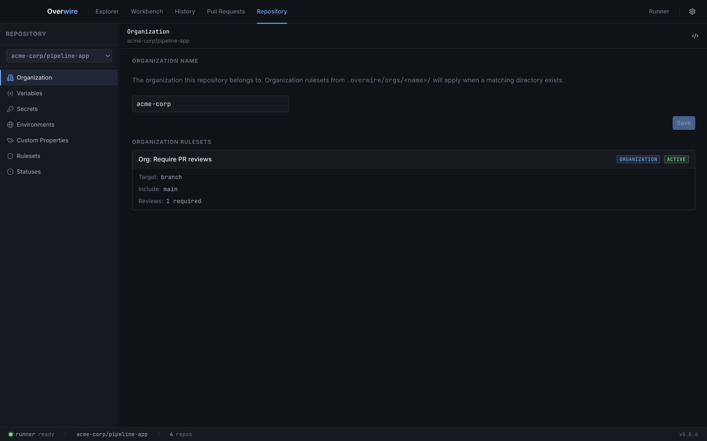
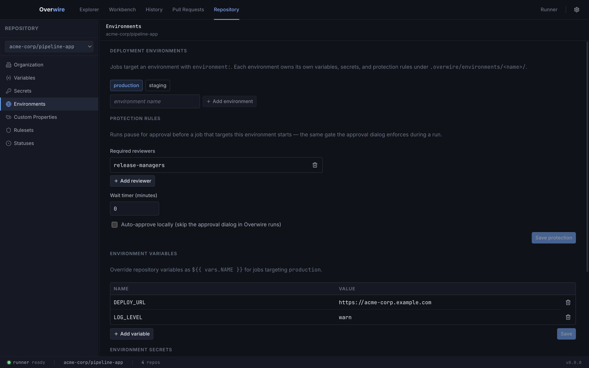
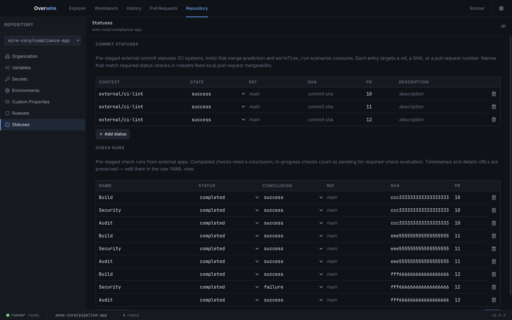

The Repository page collects every repository-scoped scenario input in one place. Each section is a structured editor over a file in the [config root](/concepts/config-root/), so everything you change here stays diffable, scriptable, and editable outside the app. Editors that sit over a single file have a raw-YAML toggle in their header.

In a multi-repo workspace, the switcher at the top of the sidebar picks which repository you are editing.

## Organization

Sets the repository's owner, which together with the project folder name forms its `owner/repo` identity. Renaming the owner updates `instances.yml` and propagates across the app. When a matching `.overwire/orgs/<owner>/` directory exists at the workspace config root, its organization rulesets are listed read-only here — they cascade onto this repository and merge with repository rulesets during [merge prediction](/app/pull-requests/).

## Variables

Edits [`variables.yml`](/configuration/variables/) as a key-value table, resolved in workflows as `${{ vars.NAME }}`.

## Secrets

Edits declarations in [`secrets.yml`](/configuration/secrets/). The editor shows names and whether a value is present — values themselves never reach the UI. If literal values would be committed to git, the editor warns and offers to add the ignore rule.

## Environments

Manages deployment environments under [`environments/<name>/`](/configuration/environments/) for jobs that use `environment:`. Create or delete environments, then configure each one:

- **Protection rules** — required reviewers, a wait timer in minutes, and a local auto-approve toggle. These are the same rules the approval dialog enforces when a run reaches a protected environment.
- **Environment variables** — overrides of repository variables for jobs targeting the environment.
- **Environment secrets** — environment-scoped secrets, shown as names with a value-present indicator, exactly like repository secrets.

Deleting an environment removes its directory and all three config files.

## Custom Properties

Edits [`custom-properties.yml`](/configuration/custom-properties/) — organization-defined repository metadata (team, tier, classification) that surfaces in event payloads as `repository.custom_properties`.

## Rulesets

Edits [`rulesets.json`](/configuration/governance/) in the platform's native export format. Organization rules appear above repository rules with a source badge; org rules are read-only here and edited through their files under `orgs/<owner>/`.

## Statuses

Edits [`statuses.yml`](/configuration/scenarios/) — pre-staged external commit statuses and check runs, the way a third-party CI or scanner would have reported them upstream. Two tables:

- **Commit statuses** — context, state, and a target (`ref`, `sha`, or `pr`).
- **Check runs** — name, status, and conclusion. Completed checks require a conclusion; anything still in progress counts as pending for required-check evaluation.

Entries whose names match required status checks in your rulesets feed merge prediction on the [pull requests page](/app/pull-requests/) and `workflow_run` scenarios. Timestamps and details URLs are preserved on save and editable through the raw-YAML view.
