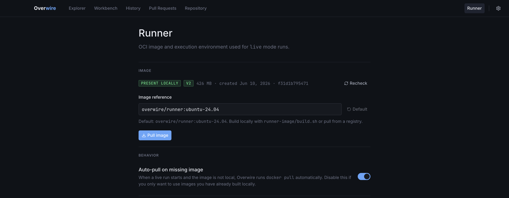

Live steps execute inside a runner container, never on your machine directly. The Runner page (the **Runner** tab in the top navigation) manages the two things that makes that work: the connection to a Docker-API-compatible container engine, and the runner image itself.

## Container engine

The status bar LED shows engine health at all times, and the same probe backs this page. Overwire talks to any Docker-API-compatible engine (Docker Desktop, Colima, OrbStack, Rancher Desktop). Without one, mock runs keep working; only live execution needs the engine. The CLI's [`doctor`](/cli/doctor/) command runs the equivalent checks in the terminal.

## Runner image

The image section shows whether the configured image is present locally, its compatibility version badge, size, creation date, and digest, with a **Recheck** button to re-probe. The image reference defaults to `overwire/runner:ubuntu-24.04` and can point at any tag you have built or mirrored; **Pull image** fetches it with progress and a cancel control.

The version badge matters: the app and the image share a compatibility contract, and an older image still runs but may fall back on newer features. For example, JavaScript actions declaring `using: node16` or `node24` get the matching side-by-side Node runtime from a v2 image, and fall back to the image's default Node with a step diagnostic on older images.

**Auto-pull on missing image** controls what happens when a live run starts without the image present: pull automatically, or fail fast if you only want locally built images.

## Tool cache

The tool cache is a host directory bind-mounted into every job container as `RUNNER_TOOL_CACHE`, so tools installed by `setup-*` actions persist across runs instead of downloading every time. The host directory is configurable here; leave it empty for the default location. The CLI exposes the same cache through [`overwire cache tool-cache`](/cli/cache/) for listing and evicting entries.
