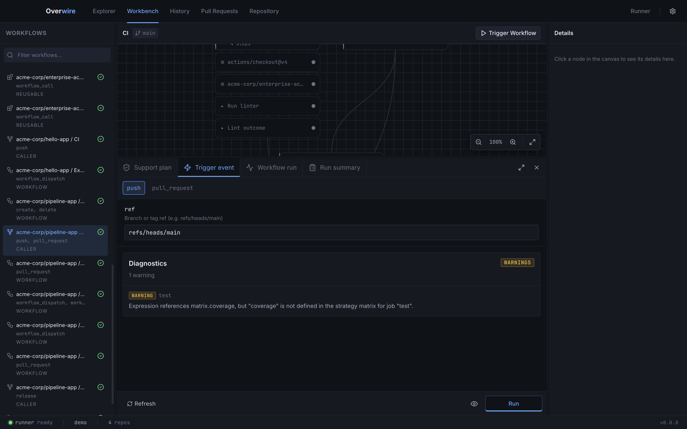
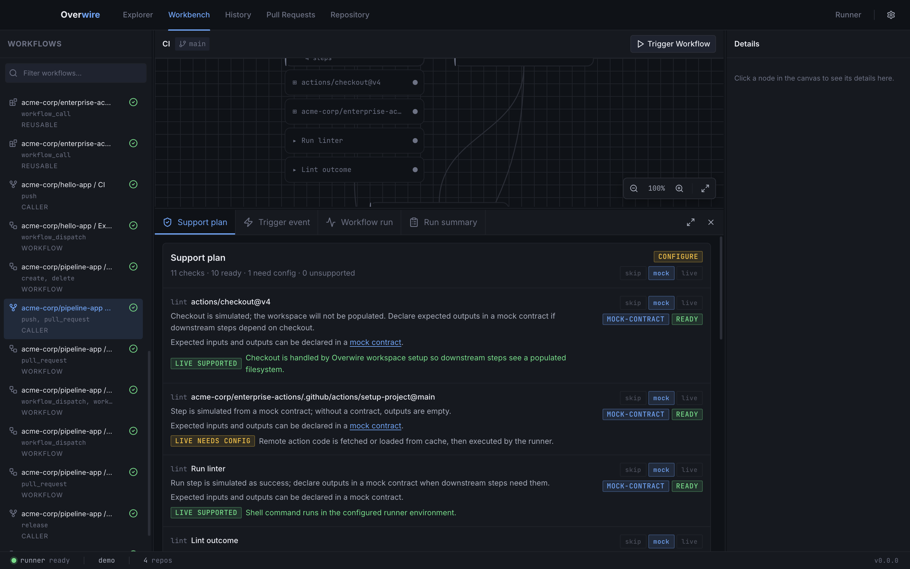
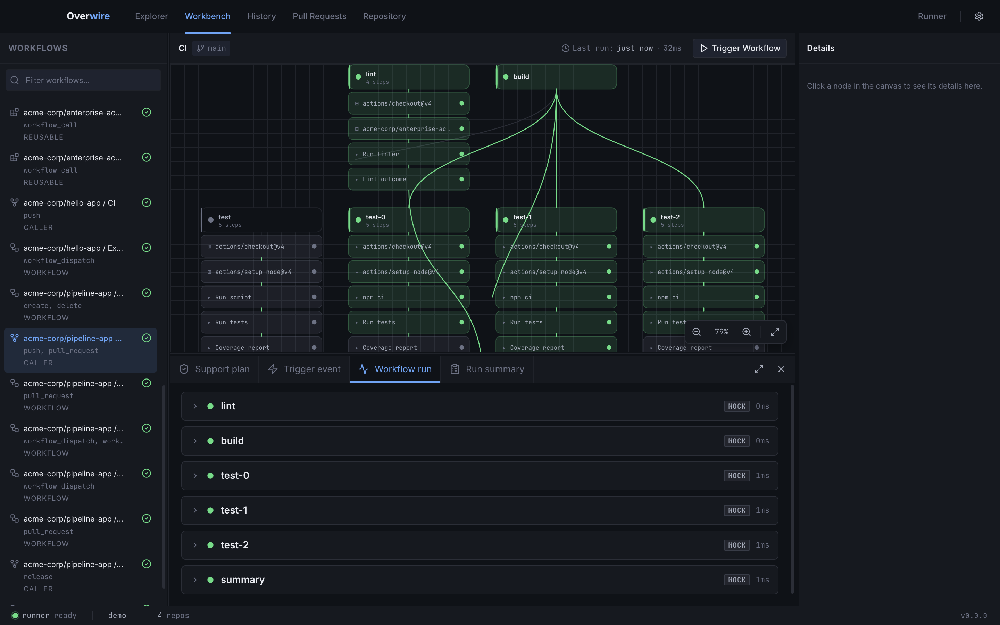
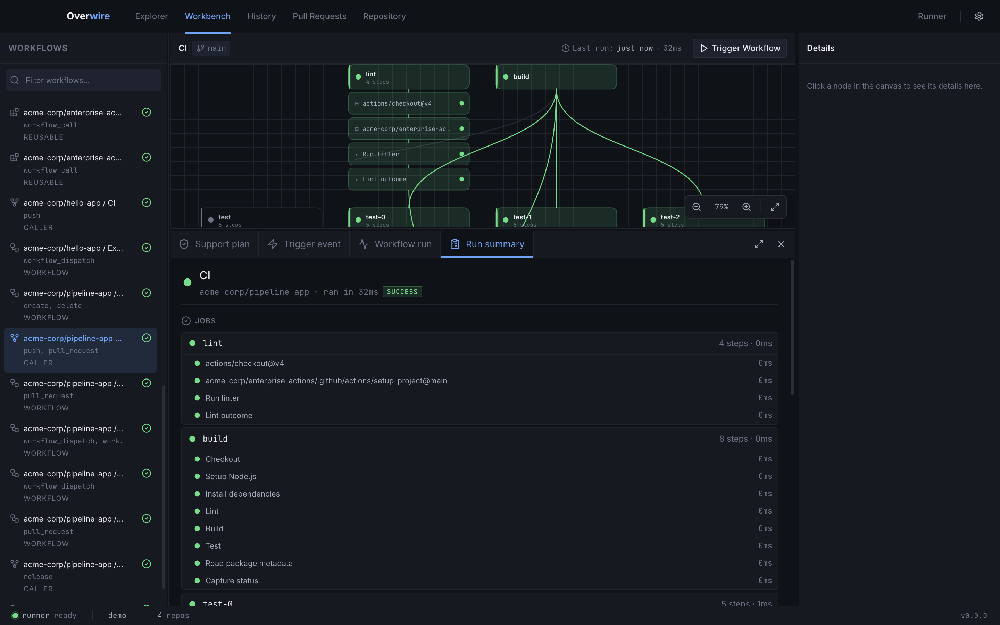

The bottom panel follows a run through its whole lifecycle across four tabs: **Support plan**, **Trigger event**, **Workflow run**, and **Run summary**. Toggle it with `⌘J`, or maximize it with the expand button in the tab bar.

## Trigger event

This tab configures what "happens" to start the run. It shows one sub-tab per trigger the workflow declares in `on:`, with a form for that event's interesting fields, such as the ref for a `push` or the action and branches for a `pull_request`. A `workflow_dispatch` trigger renders its declared inputs as a form, with defaults saved per workflow.

Field values persist to [`payloads/<event>.json`](/configuration/payloads/) and dispatch defaults to `dispatch/<workflow>.yml`, so the CLI sees the same event you configured here. A **Diagnostics** card below the form surfaces pre-run validation and static analysis findings, such as expression references that cannot resolve, before anything executes.

**Run** starts the workflow. The eye toggle next to it arms watch mode: after the next run, changes to the workflow, its config, or workspace files re-trigger the same run automatically until you switch it off.

## Support plan

Before running anything, the support plan explains how Overwire will satisfy every step: which provider backs it (runner shell, Overwire service, action code, mock contract), its support status, and any warnings. Each row carries inline skip/mock/live buttons, so you can set modes right where the explanation is.

For mockable `uses:` steps the row links to the step's [mock contract](/configuration/mocks/), creating the file on first use. The same classification logic backs [`overwire explain`](/cli/explain/) in the CLI; the background is in [support tiers](/concepts/support-tiers/).

## Workflow run

Once a run starts, this tab shows a card per job with its steps, statuses, and mode badges, updating live as output streams in. Click any completed step to open its detail view: full logs, outputs, resolved environment, diagnostics, an expression evaluator for probing `${{ }}` expressions against the run's real context, and a re-run-from-this-step action.

## Run summary

The summary tab condenses the finished run: outcome, per-job durations and outputs, step summaries rendered as Markdown, produced artifacts, and the GitHub API requests the run made against the local mock server, badged as matched or unmatched. From here you can re-run only the failed jobs and their dependents.

Every run also persists to the [run store](/concepts/runs/), so the History page can list, inspect, and diff runs after the panel closes.
