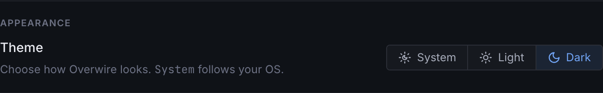
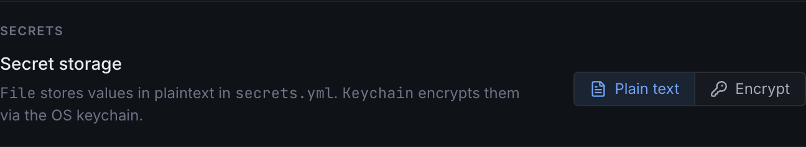
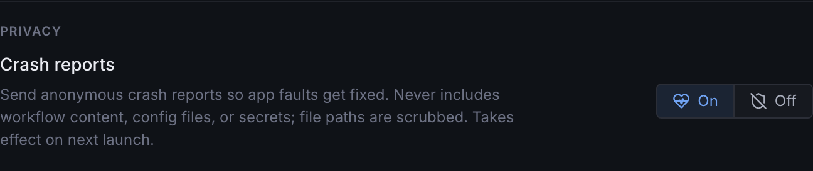

Settings open with `⌘,` or the gear in the top navigation. The sections cover appearance, secret storage, privacy, run history retention, and support tooling.

## Appearance

Theme follows your OS by default, or pins to light or dark. `⇧⌘T` cycles the theme from anywhere in the app.

## Secret storage

Two modes for the values in [`secrets.yml`](/configuration/secrets/):

- **Plain text** keeps values in the file. They stay on your machine, and `init` scaffolds the ignore rules that keep them out of git.
- **Encrypt** moves values into the OS keychain via the system's safe storage, leaving only declarations in the file.

Switching modes migrates existing values in both directions. One trade-off to know: the CLI resolves secrets from `secrets.yml` and the environment, so values encrypted into the keychain are available to the desktop app only.

## Privacy

Crash reporting is opt-out and applies from the next launch. Reports are scrubbed of home-directory paths before leaving the machine, and builds without reporting configured send nothing at all.

## Run history

**Recent runs to keep** caps how many recent runs the app retains per repository in its quick lists. Full run records remain in the [run store](/concepts/runs/) on disk.

## Support

**Diagnostic bundle** exports the same redacted bundle as [`overwire doctor --bundle`](/cli/doctor/): environment facts, a names-and-sizes config inventory, and failed-step run summaries, with no secret values and no file contents. Review it before sharing; it is written wherever you choose to save it.
