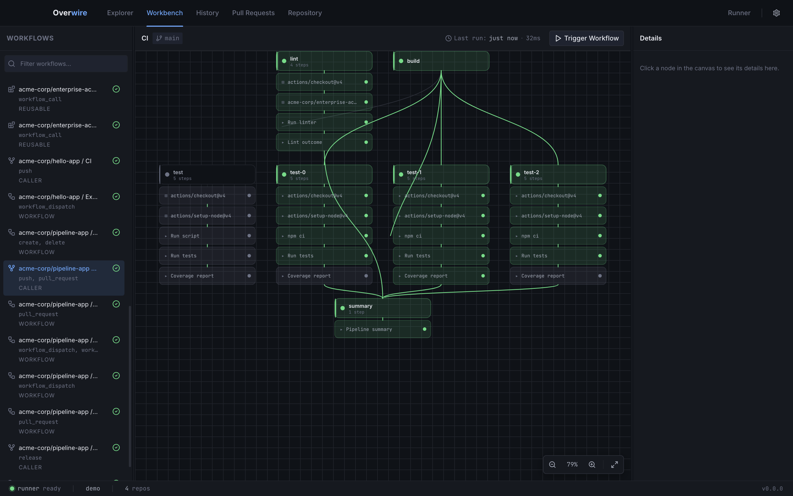
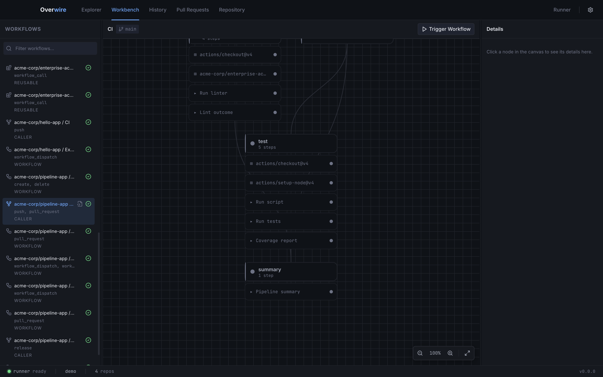
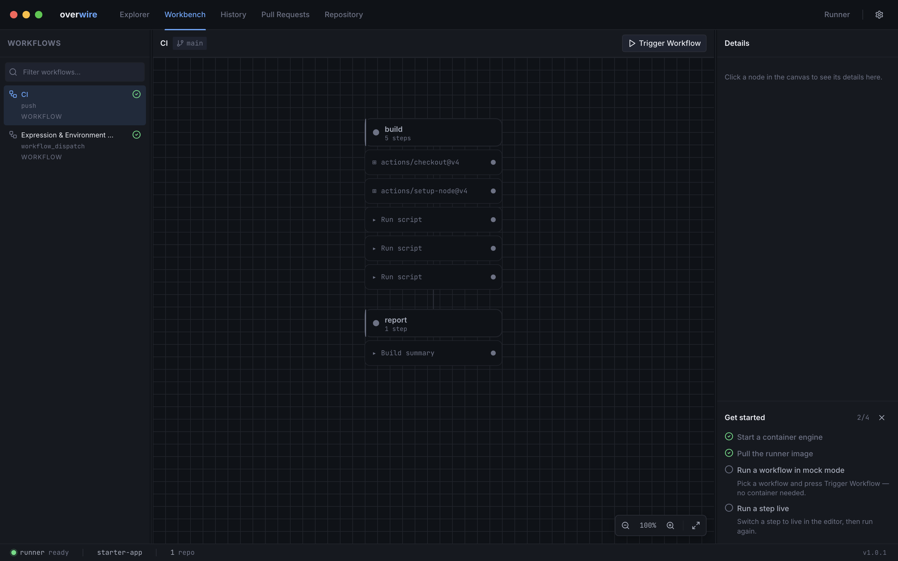

The workbench is the page you land on: a filterable workflow list on the left, an interactive DAG canvas in the middle, and a detail panel on the right. Select a workflow, trigger it, and watch the graph light up as jobs complete.

## Workflow list

The sidebar lists every workflow discovered in the workspace, with its triggers and kind (workflow, reusable, caller) under the name. In a multi-repo workspace each entry is prefixed with its `owner/repo` identity, and the filter box narrows the list across all repositories at once.

Hovering an entry reveals a view-YAML button that jumps to the file in the [Explorer](/app/editors/).

## DAG canvas

The canvas renders the selected workflow as a dependency graph: a header node per job, step nodes beneath it, and edges for `needs:` relationships. Matrix jobs appear as their expanded variants once a run starts.

- **Pan and zoom.** Drag to pan, scroll to zoom (15% to 300%). The corner toolbar has zoom buttons and fit-to-view, and the canvas re-fits when the graph structure changes.
- **Status.** Node accents follow the run: neutral while idle, then running, success, failure, or skipped per job and step.
- **Selection.** Click a job node to inspect it in the detail panel. Click a step node after a run and the [runs panel](/app/runs-panel/) opens that step's detail view with logs and outputs.

## Detail panel

The right panel shows the selected node: job ID, display name, steps, and dependencies. With nothing selected it waits until you click a node in the canvas.

## Triggering a run

**Trigger Workflow** in the toolbar starts a run using the event configured in the runs panel, and the toolbar shows when the workflow last ran. The bottom panel tracks the run from [support plan to summary](/app/runs-panel/).

## First-run checklist

Until your first runs complete, a dismissible **Get started** card sits in the detail panel with four steps: a reachable container engine, the runner image, a first mock run, and a first live run. The first two are probed automatically; the card disappears for good once both run milestones are met.

## Keyboard shortcuts

| Shortcut | Action |
| --- | --- |
| `⌘1` to `⌘5` | Switch between Explorer, Workbench, History, Pull Requests, and Repository |
| `⌘J` | Toggle the runs panel |
| `⌘.` | Cancel the active run |
| `⌘,` | Open settings |
| `⇧⌘T` | Cycle theme (dark, system, light) |
