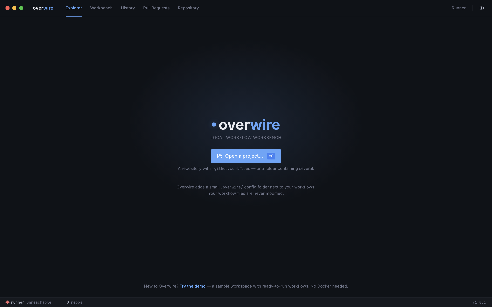
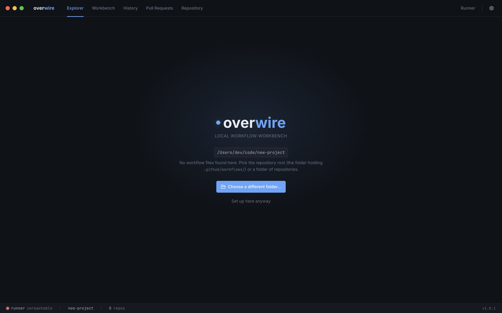

Overwire keeps all of its state in a flat `.overwire/` directory next to your `.github/` tree. Your workflow YAML is never modified: step modes, mock contracts, payloads, and platform scenario files all live as plain, diffable sidecar files.

## Single repository

From the repository root:

```sh
overwire init
```

This scaffolds:

| Path | Purpose |
| --- | --- |
| `settings.yml` | Repository owner and Overwire settings |
| `variables.yml` | Repository variables for `${{ vars.* }}` |
| `secrets.yml` | Secret declarations (values optional, local-only) |
| `modes/` | Workflow default and per-step mode overrides |
| `mocks/` | Mock contracts for `uses:` steps |
| `payloads/` | Saved event payload overrides |
| `.gitignore` | Keeps `secrets.yml` and local run state out of git |

The owner is inferred from your git remote and falls back to `local` when no remote exists. Override it with `--owner <owner>`.

The scaffolded `.overwire/.gitignore` ignores `secrets.yml`, `state/`, and `cache/`, so secret values and local run state never reach your repository while the rest of the config stays committable.

## Workspaces with multiple repositories

To test workflows that span repositories (reusable workflows, `workflow_run` chains), initialize a workspace at the parent directory:

```sh
overwire init --workspace
```

This writes `instances.yml` at the workspace `.overwire/`, auto-discovering child directories that contain a `.github/` or `.overwire/` tree. Each entry stores a relative path, so the workspace stays portable.

## Options

| Option | Description |
| --- | --- |
| `--owner <owner>` | Organization or user owning this repo (inferred from git remote if omitted) |
| `--config-root <dir>` | Root for the config tree, relative to cwd (default `.overwire`) |
| `--force` | Overwrite existing config files |
| `--workspace` | Create a workspace-level `.overwire` with auto-discovered child repos |

## In the desktop app

The app starts on an open-project screen until you point it at a directory:



Opening a repository — or a folder of repositories — sets it up automatically: the app scaffolds `.overwire/` (including the `.gitignore` and child-repo auto-discovery) and announces it, with no separate initialize step. Only a directory with no workflow files anywhere shows a guidance screen instead, with a **Set up here anyway** action for repositories you are starting from scratch:



## Next step

Run your first workflow: [first mock run](/getting-started/first-mock-run/).
